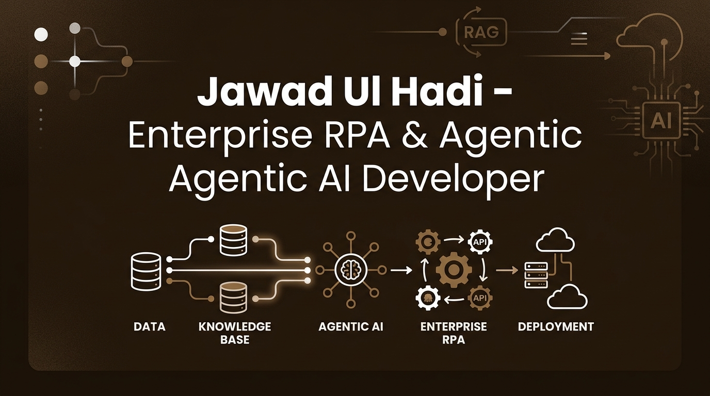

<div align="center">
  
</div>

# Jawad Ul Hadi - Enterprise RPA & Agentic AI Portfolio

A high-performance, single-page application architectural framework built using **React 19**, **Vite**, and **Tailwind CSS**. This repository hosts the source code for my professional portfolio, illustrating production-ready systems that merge legacy enterprise software with autonomous cognitive workflows.

## 🚀 Key Architectural Showcases

The repository features comprehensive project structures and schema representations for:
*   **Enterprise Knowledge Assistant:** A distributed RAG platform using hybrid vector search pipelines (NestJS, Python, Pinecone).
*   **LLM Ticket Automation System:** Event-driven, low-latency triage workflows connecting webhook entry points to UiPath robotic workforces.
*   **Agentic Procurement Engine:** Cognitive invoice-matching software integrated with SAP MM architectures and deep OCR extraction layers.
*   **FinTech Workflow Engine:** Distributed, high-throughput microservices engineered under strict banking compliance guidelines (SOC2).

---

## 🛠️ Tech Stack & Dependencies

### Frontend Core
*   **Framework:** React 19 (TypeScript implementation)
*   **Build Utility & Bundler:** Vite 6
*   **Styling Engine:** Tailwind CSS 4
*   **Animation System:** Motion (Framer Motion)
*   **Icon Library:** Lucide React

### Integrated Backend Paradigms
*   **Languages:** Python, Node.js / TypeScript, Go
*   **Agent Orchestration:** LangChain, AutoGen, CrewAI
*   **Vector Infrastructure:** Pinecone, Qdrant, PostgreSQL (pgvector)
*   **RPA Systems:** UiPath Orchestrator, Power Automate

---

## ⚙️ Local Development Setup

Ensure you have **Node.js** (v18 or higher recommended) installed on your system.

### 1. Clone & Install Dependencies
```bash
git clone https://github.com
cd jawad-rpa-agentic-ai-portfolio
npm install
```

### 2. Configure Environment Variables
Duplicate the environment template file and insert your API keys:
```bash
cp .env.example .env.local
```
Configure your credentials inside `.env.local`:
```env
GEMINI_API_KEY="your_actual_gemini_api_key_here"
APP_URL="http://localhost:3000"
```

### 3. Execution Commands
*   **Development Server (Local HMR):** `npm run dev` (Runs on port `3000`)
*   **Production Compilation:** `npm run build`
*   **Local Review Compilation:** `npm run preview`
*   **TypeScript Validation:** `npm run lint`

---

## 📁 Repository Structure

```text
├── public/                 # Static graphical assets (Banners & previews)
├── src/
│   ├── components/         # Modular user interface layout definitions
│   │   ├── About.tsx       # Timeline summaries and competency highlights
│   │   ├── Hero.tsx        # High-impact introduction viewport and core tech pills
│   │   ├── Skills.tsx      # Multi-column enterprise capability matrix
│   │   ├── Projects.tsx    # Responsive grid layout rendering client workflows
│   │   └── Contact.tsx     # Secure processing communications engine
│   ├── data.ts             # Strongly-typed datasets for enterprise projects
│   ├── App.tsx             # Root template component structure
│   ├── index.css           # Global Tailwind directive injections
│   └── main.tsx            # Application bootstrapping mount logic
├── .env.example            # Deployment environment parameters boilerplate
├── vite.config.ts          # Build environment compilation parameters
└── tsconfig.json           # Compiler rules mapping layer
```
